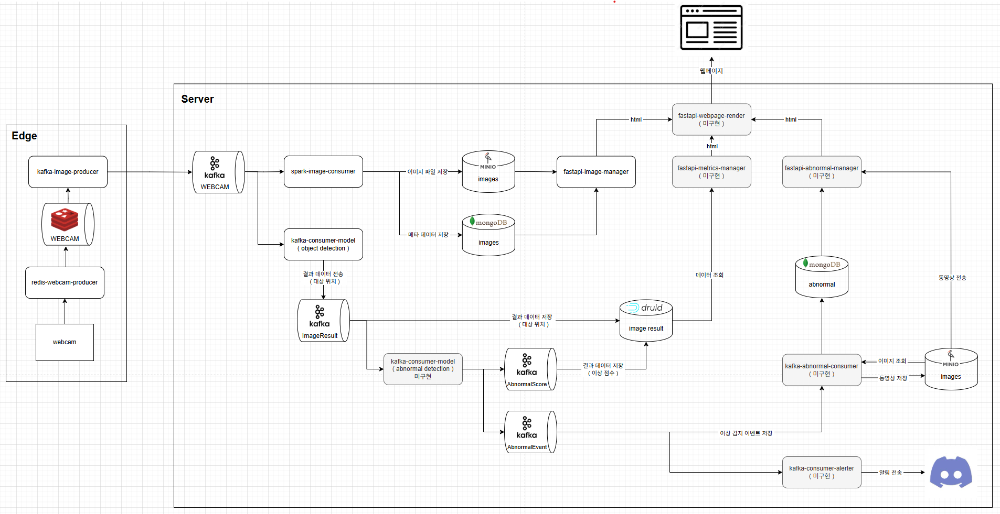
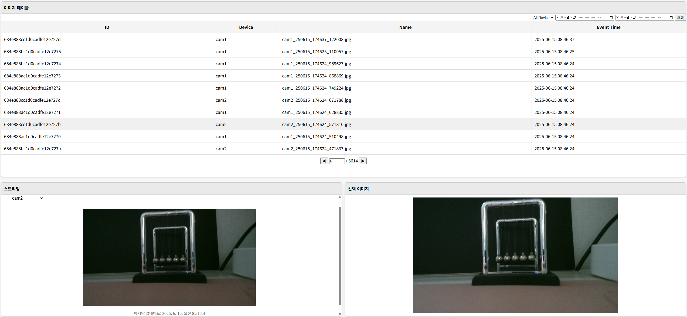

# 실시간 영상 기반 이상 감지 시스템

## Overview

> 실시간 웹캠 영상 데이터를 Edge에서 수집하고, Kafka 기반 스트리밍 파이프라인을 통해 객체 탐지 및 이상 감지를 수행한 후, 이벤트 저장 및 알림까지 처리하는 통합 관제 시스템입니다.

---

## 주요 기능

- ✅ Edge에서 실시간 영상 이미지 수집 (OpenCV + Redis Stream → Kafka)
- ✅ Kafka 기반 메시징 파이프라인 구축
- ✅ 이미지 저장 (MinIO), 메타데이터 저장 (MongoDB)
- ✅ 객체 탐지 처리 (Object Detection Kafka Consumer)
- ✅ 이상 감지 처리 (Anomaly Detection Kafka Consumer)
- ✅ 이상 이벤트 Druid 시계열 저장
- ✅ FastAPI 기반 웹페이지를 통한 결과 시각화

> ⚠️ 다이어그램의 회색 박스는 미구현된 서비스로, 향후 개발 예정입니다.

---

## 시스템 구성

- **Edge**
  - 실시간 웹캠 이미지 수집
  - 이미지 → Redis Stream → Kafka 전송

- **Server**
  - Kafka Consumer로 객체 탐지 및 이상 감지 수행
  - 분석 결과를 MinIO, MongoDB, Druid에 저장
  - FastAPI 기반 웹서비스로 데이터 조회 및 시각화
  - (예정) 이상 이벤트 알림 및 관리자 인터페이스 구성

---

## 기술 스택

| 카테고리    | 기술                               |
|---------|----------------------------------|
| 데이터 수집  | OpenCV, Redis Stream, Kafka       |
| 데이터 분석  | Python, PyTorch, ONNX            |
| 저장소     | MongoDB, MinIO, Druid            |
| 웹 프론트엔드 | FastAPI, HTML(Jinja2)            |
| 배포 환경   | Docker, K3s (Kubernetes 경량 클러스터) |

---

## 📷 웹 UI 스크린샷 (구현 완료)

> FastAPI 기반 웹페이지에서 이미지 목록, 스트리밍, 선택 이미지 조회가 가능합니다.

- 전체 이미지 조회 테이블
- 스트리밍 디바이스 선택 기능
- 선택 이미지 상세 확인

  
※ 실시간 수집 이미지 및 메타데이터를 기반으로 조회 가능

---

## TODO (개발 예정 항목)

- [ ] `kafka-consumer-model (abnormal detection)`  
      - 시계열 이상 감지 모델 선정 및 훈련
- [ ] `kafka-abnormal-consumer`  
      - 이상 이벤트 저장 및 영상 파일 생성
- [ ] `fastapi-metrics-manager`  
      - 시계열 메타데이터 관리 및 조회 기능
- [ ] `fastapi-abnormal-manager`  
      - 이상 이벤트 목록/상세 조회 및 관리
- [ ] `fastapi-webpage-render`  
      - FastAPI 서비스 내 웹페이지 구성 조합 기능
- [ ] `kafka-consumer-alerter`  
      - 이상 이벤트 알림 기능 (Discord Webhook 연동 예정)

---

## 향후 계획

- Prometheus, Grafana를 활용한 시스템 성능 모니터링 기능 추가
- 데이터 파이프라인 최적화 (Kafka 병렬 처리, 컨슈머 리소스 튜닝 등)
- 대규모 배치 분석 기능 추가 구상
- 로그인 및 사용자 관리 기능 추가 (FastAPI 인증 기반)
- 이상 이벤트 검색 기능 (Elasticsearch + 사용자 코멘트)
- 학습 데이터셋 구성 기능 및 관리자 UI 구현
- MLops 구성: 데이터셋 구축, 모델 학습, 모델 배포 자동화
